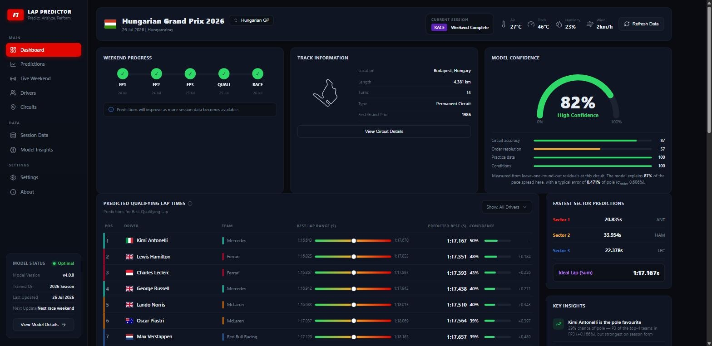
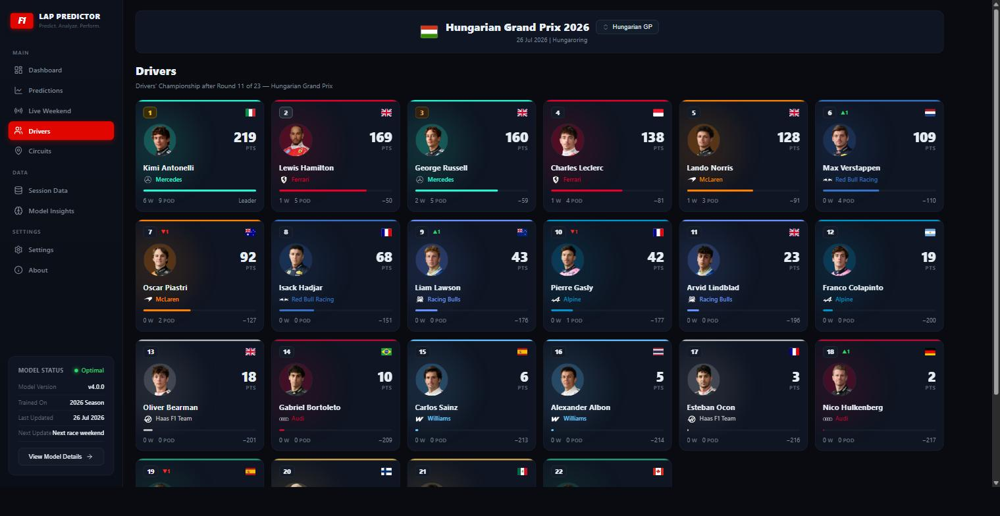
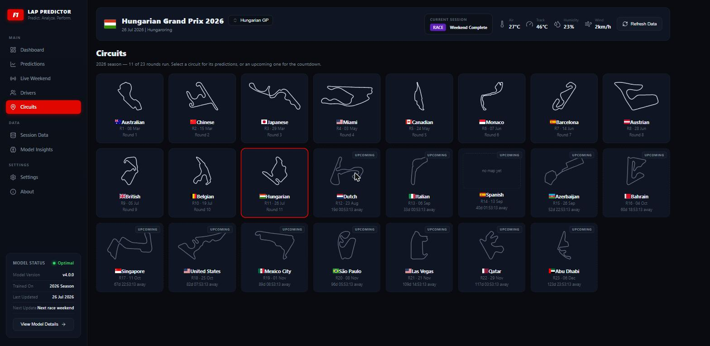
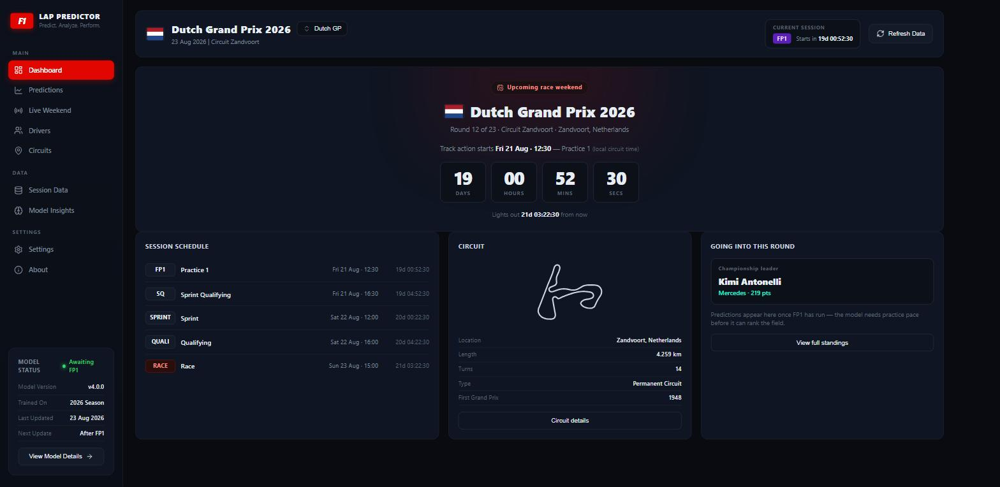

# F1 Lap-Time Predictor

Predict F1 lap times from tyre compound, tyre age, weather, driver/team, circuit,
and a fuel-load proxy — then track a live race weekend and compare real pace to
what the model expects.

The qualifying model predicts each driver's **gap to pole in percent** from
practice pace plus season form, and it does so *before qualifying runs*. Measured
over 11 rounds of 2026, leave-one-round-out: **0.439% MAE** (~0.36 s), pole
called correctly in **7 of 11** rounds.

## The dashboard

Predicted qualifying order, with the measured confidence behind it — the gauge
breaks down into circuit accuracy, order resolution, practice volume and
conditions, none of which are asserted rather than measured.



The drivers' championship *as it stood after the selected race week*, not today's
table. Pick an earlier round and you see what a fan would have seen at the time,
including places gained and lost that weekend.



The full calendar. Rounds already run open their predictions; rounds still to
come are marked upcoming and count down live.



Selecting a weekend that hasn't happened shows the session schedule in local
circuit time, a countdown to first practice, and the championship going into that
round. Predictions replace this as soon as FP1 data lands.



## Data source

**FastF1** is the primary source (official F1 timing API, 2018–present) — it's the
only source with tyre compound, tyre age, weather, and sector data. The Ergast
JSON in `data/raw/` is kept as secondary race metadata. **Fuel load is never
published by teams**, so it's approximated by lap number within a stint (fuel
burns ~linearly).

## Layout

```
src/
  config.py        paths + FastF1 cache (import to enable)
  data_loader.py   load_session_laps(year, round, "Q"/"R"/"FP1"..) -> clean lap DataFrame
  dataset.py       build_quali_dataset / build_practice_dataset / build_race_dataset
  features.py      feature schemas + model pipeline (TargetEncoder + HistGBR)
  practice.py      normalise FP1/FP2/FP3 pace; team strength; top-4 pole battle
  gapmodel.py      practice pace -> qualifying gap to pole (leave-one-round-out)
  confidence.py    per-circuit sigma, Monte Carlo position/pole probabilities
  train.py         time-based train/eval, saves models/{kind}_model.joblib
  predict.py       load a model and score laps (historical or live)
  live.py          record / monitor / replay a live race weekend
  refresh.py       incremental, session-level dataset updates during a weekend
  standings.py     race + sprint results -> drivers' championship after any round
  f1_media.py      download official F1 driver portraits + team logos to web/assets/
  dashboard_data.py  assemble web/data/dashboard.json
  webapp.py        static server + /api/dashboard, /api/events
data/
  raw/         Ergast JSON (secondary)
  cache/       FastF1 cache (auto)
  processed/   built datasets (quali_, practice_, race_dataset.csv, results_YYYY.csv)
  live/        recorded live-timing streams
models/        trained model bundles
web/assets/    driver portraits + team logos (fetched, not committed by hand)
```

## Quickstart

```bash
pip install -r requirements.txt

# 1. Build datasets (fetches + caches; slow first time)
python src/dataset.py --kind both --years 2022 2023 2024 2025

# 2. Train + evaluate (time-based split — never random)
python src/train.py --kind quali --train-years 2022 2023 2024 --test-years 2025
python src/train.py --kind race  --train-years 2022 2023 2024 --test-years 2025

# 3. Test the live monitor against a finished race (no live session needed)
python src/live.py replay --year 2025 --round 1 --session R
```

## Live race weekend (e.g. Dutch GP, 2026-08-23)

Two terminals — one records the live stream, one shows predictions:

```bash
# Terminal 1 — start when the session goes green:
python src/live.py record --out data/live/dutch_race.txt

# Terminal 2 — updates every 30s as laps come in:
python src/live.py monitor --file data/live/dutch_race.txt \
    --year 2026 --round 12 --session R
```

The monitor shows, per driver: **predicted next lap** (fastest expected first)
and **latest lap actual vs model** (Δ<0 = faster than the model expected, i.e.
overperforming their car/tyre/fuel state).

## Modelling notes

- **Validation is time-based** (train past seasons, test a held-out later one).
  A random split leaks the future and lies about accuracy — the #1 motorsport-ML
  mistake.
- **Every current track must appear in training.** Predicting an unseen track's
  absolute lap time is impossible (Monaco ~72s vs Spa ~104s). This is why we
  train on multiple seasons — China (returned 2024) and Imola (2023 cancelled)
  otherwise have no signal.
- **TargetEncoder** handles a mid-season rookie or new team gracefully (maps to
  the global mean instead of crashing) — important for live use.

## Qualifying predictions from practice pace

The dashboard's qualifying order comes from a second model that predicts a
**relative** target — each driver's gap to pole in percent — rather than an
absolute lap time. That matters because with a single season of data every
circuit is seen once, so holding out a round makes its circuit unseen and an
absolute-time model collapses (~8.5s MAE). A circuit-relative target can be
validated leave-one-round-out honestly.

```bash
python src/dataset.py --kind practice --years 2026   # FP1/FP2/FP3 (33 sessions)
python src/practice.py      # which practice metric predicts qualifying best
python src/gapmodel.py      # leave-one-round-out model comparison
python src/confidence.py    # per-circuit sigma and gauge breakdown
```

Measured on 2026 rounds 1–11, leave-one-round-out:

| model | MAE (gap %) | pole called correctly |
|---|---|---|
| ridge (practice + form) | **0.448** | **7/11** |
| season form only | 0.475 | 6/11 |
| gbm (practice + form) | 0.494 | 5/11 |
| practice only (rescaled) | 0.708 | 3/11 |

Key details:

- **Practice times are normalised within their own session.** Track evolution,
  temperature and fuel loads move a whole session together, so only the gap to
  that session's best lap is comparable. Ranking drivers against each other then
  requires one common *reference session* (the last dry one) — otherwise whoever
  topped FP1, FP2 and FP3 all show a 0.000% gap.
- **Rookies on mandatory FP1 outings are filtered out** — they appear in practice
  but never qualify, and would otherwise invent grid slots.
- **Confidence is measured, not assumed.** Per-circuit residual sigma comes from
  the out-of-fold errors, split into a component that shifts the whole field
  (irrelevant to ordering) and the driver-to-driver scatter that actually
  reshuffles it. Positions and pole odds come from simulating the field 20,000
  times at that sigma. The gauge blends circuit accuracy (40%), order resolution
  (30%), practice data volume (20%) and conditions (10%).

## Predicting before qualifying (live weekends)

The dashboard predicts a qualifying order **from the first practice session
onwards, and always before qualifying starts** — which is the only time the
prediction is worth anything. Each session is fetched independently as it ends,
so the order appears after FP1 and is re-predicted after FP2 and FP3.

How many sessions a weekend is expected to run comes from the schedule rather
than being hard-coded, so the UI can say what is still to come:

| format | expects |
|---|---|
| conventional | FP1, FP2, FP3 |
| sprint | FP1 |

Measured on Hungary 2026, holding back qualifying and adding practice a session
at a time:

| built from | clean laps | confidence |
|---|---|---|
| FP1 | 337 | 80 |
| FP1 + FP2 | 716 | 80 |
| FP1 + FP2 + FP3 | 932 | 82 |

```bash
python src/webapp.py                      # auto-refresh every 10 min (default)
python src/webapp.py --refresh-min 3      # check more often during a session
python src/webapp.py --refresh-min 0      # disable; refresh by hand instead

python src/refresh.py                     # one-off catch-up
python src/refresh.py --loop 300          # standalone poller, every 5 min
```

How it fits together:

- **`refresh.py` works one session at a time.** `dataset.py` only looks at rounds
  whose *race* has finished, which is useless mid-weekend. `refresh.py` asks the
  schedule what has ended (session start + scheduled length + a grace period),
  compares that with the CSVs, and fetches only the gap — so a mid-weekend call
  costs one session load, not a season.
- **The server refreshes itself.** `webapp.py` runs the check on a daemon thread
  and also exposes `/api/refresh`, which the Refresh Data button calls. Both go
  through one lock so two FastF1 fetches never write the same CSV at once.
- **No restart needed.** `_pace_bundle()` is cached on the *mtimes* of the
  practice and quali CSVs, so the first request after new data lands refits the
  model automatically.
- **The gate is practice, not qualifying.** `build_dashboard` predicts whenever
  the pace model can produce a row for the event. The model layer already
  supported this — `build_feature_table` leaves `QualiGapPct` as NaN for a round
  with no result (so it is excluded from training but still predicted), and
  `_race_lineup` falls back to the last completed round's entry list.
- **The page says when it is working.** Every data load puts a blocking overlay
  up — *"Predicting qualifying pace… Running the practice → qualifying model on
  this weekend's practice data"* — with an elapsed counter. After 4 seconds the
  detail line swaps for the reason it is slow, which differs by path: a refit
  after new practice data, or a FastF1 session download during a refresh. A warm
  prediction takes ~0.1 s so the overlay barely flashes; it earns its keep on the
  first request after new data lands.
- **The page says how much it knows.** While practice is in and qualifying hasn't
  run, the payload carries `preQuali: true` plus a `practice` block (`used`,
  `expected`, `remaining`, `complete`, `laps`). The banner is amber while
  sessions are outstanding — *"Built from FP1 so far — FP2 and FP3 still to run
  (337 clean laps logged)"* — and green once practice is complete, so a call made
  off one session never reads as settled. Conditions shown are the practice
  medians, since no qualifying weather exists yet.

Once qualifying has actually run, the same view switches back to the
leave-one-round-out prediction, so the number on screen is never one that has
already seen the answer.

## The full calendar, including rounds still to come

`list_events()` lists every round of the season from the FastF1 schedule, not
just the ones with data, and flags each with `hasData`. Selecting a round that
hasn't run returns an **upcoming-weekend payload** instead of predictions: the
session schedule with local start times, UTC targets for a live countdown, the
circuit, and the championship as it stands going into that round.

Countdowns are driven entirely by the browser — the payload carries ISO
timestamps, and one interval in `app.js` refreshes every element carrying
`data-countdown`. Nothing is a duration frozen at build time.

Two upstream quirks are corrected in `dashboard_data.py`:

- FastF1's provisional 2026 schedule lists the **Bahrain GP at "Kuala Lumpur"**;
  `_SCHEDULE_LOCATION_FIX` maps that event back to Sakhir.
- The schedule calls Abu Dhabi's venue "Yas Marina" while the track maps are
  keyed "Yas Island"; `_canonical_circuit` resolves such variants.

Circuits with no recorded telemetry (Madrid, new for 2026) show "no map yet"
rather than a generic outline — the maps are derived from real position data, so
inventing one would be a lie.

## Drivers' championship standings

The **Drivers** view shows the championship *as it stood after the race week you
have selected*, not today's table — pick an earlier round from the picker at the
top and you see the standings a fan would have seen at the time, including places
gained/lost that weekend.

```bash
python src/standings.py 2026    # cache race + sprint results, print the table
python src/f1_media.py 2026     # portraits + team logos -> web/assets/
```

- Points are read from FastF1's session results, so the current scoring system
  (including sprint points) is never hard-coded here.
- Ties break by the FIA countback — most wins, then most seconds, and so on.
- `standings.py` only fetches rounds missing from `data/processed/results_YYYY.csv`,
  so re-running it after a race weekend costs one or two session loads.
- Portraits and logos are the transparent cut-outs from formula1.com, downloaded
  once and served locally so the dashboard still works offline.
